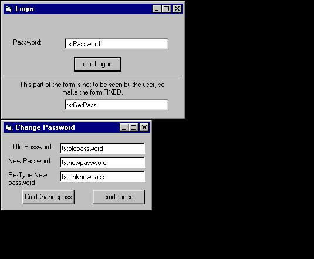

<div align="center">

## Simple & Easy Password Protection, With the option to change password \!


</div>

### Description

This protects a form or program by adding a login form or protection to a form. It also includes a form which enables you to change the password.

NOTE: This should not be used as HIGH security as it can be hacked by simply looking in the registry. Good for newbies and begginers though. Please vote for me!!
 
### More Info
 
Very little knowledge required, just some knoewledge of the VB Interface, thats all.


<span>             |<span>
---                |---
**Submitted On**   |
**By**             |[Michael Leach](https://github.com/Planet-Source-Code/PSCIndex/blob/master/ByAuthor/michael-leach.md)
**Level**          |Beginner
**User Rating**    |5.0 (10 globes from 2 users)
**Compatibility**  |VB 4\.0 \(32\-bit\), VB 5\.0
**Category**       |[Encryption](https://github.com/Planet-Source-Code/PSCIndex/blob/master/ByCategory/encryption__1-48.md)
**World**          |[Visual Basic](https://github.com/Planet-Source-Code/PSCIndex/blob/master/ByWorld/visual-basic.md)
**Archive File**   |[](https://github.com/Planet-Source-Code/michael-leach-simple-easy-password-protection-with-the-option-to-change-password__1-22064/archive/master.zip)


### Source Code

```
NOTE: The First Password will be "", or Nothing,
as there is nothing saved to that setting in the registry untill you change the password.
NOTE: See ScreenShot for info on setting the forms
up and the controls to be put on to the forms.
==================================
Put this code in the "LOGIN" form:
===================================
Private Sub cmdlogin_Click()
If txtPassword.Text = txtgetpass.Text Then
  frmMain.Show
  Unload Me
Else
  MsgBox "Invalid Password, Please try again", , "Login"
  txtPassword.Text = ""
  txtPassword.SetFocus
End If
End Sub
Private Sub Form_Load()
txtgetpass.Text = GetSetting("App", "Appname", "Password", "")
End Sub
Private Sub txtPassword_KeyPress(KeyAscii As Integer)
If KeyAscii = vbKeyReturn Then
  'If enter was pressed in the text box that inputs a message to send, simulate the pressing of the Send button.
  cmdlogin_Click
  'Clear the text box.
  KeyAscii = 0
End If
End Sub
==================================================
Put this code in the "ChangePassword form" :
==================================================
Private Sub txtoldpassword_KeyPress(KeyAscii As Integer)
If KeyAscii = vbKeyReturn Then
  'If enter was pressed in the text box that inputs a message to send, simulate the pressing of the Send button.
  txtnewpassword.SetFocus
  'Clear the text box.
  KeyAscii = 0
End If
End Sub
Private Sub txtnewpassword_KeyPress(KeyAscii As Integer)
If KeyAscii = vbKeyReturn Then
  'If enter was pressed in the text box that inputs a message to send, simulate the pressing of the Send button.
  txtchknewpass.SetFocus
  'Clear the text box
  KeyAscii = 0
End If
End Sub
Private Sub txtchknewpass_KeyPress(KeyAscii As Integer)
If KeyAscii = vbKeyReturn Then
  'If enter was pressed in the text box that inputs a message to send, simulate the pressing of the Send button.
  Command1_Click
  'Clear the text box
  KeyAscii = 0
End If
End Sub
Private Sub Command1_Click()
If txtoldpassword.Text = " " Then
  MsgBox "Please enter old password", vbOKOnly, "Login"
Else
  GoTo Checkoldpass
End If
Exit Sub
Checkoldpass:
If txtoldpassword = txtgetpass.Text Then
  GoTo checknewPass
Else
  MsgBox "Invalid Old Password, Please try again", vbOKOnly, "Login"
End If
Exit Sub
checknewPass:
If txtnewpassword.Text = "" Then
  MsgBox "Please enter a new password", vbOKOnly, "Login"
Else
  GoTo Confirmpass
End If
Exit Sub
Confirmpass:
If txtnewpassword.Text = txtchknewpass.Text Then
  GoTo Changepass
Else
  MsgBox "Password's do not match",,"Login"
End If
Exit Sub
Changepass:
SaveSetting "App", "Appname", "Password", txtchknewpass.Text
MsgBox "Password succesfully changed!", vbOKOnly, "Login"
Unload Me
End Sub
Private Sub Command2_Click()
Unload Me
End Sub
Private Sub Form_Load()
txtgetpass.Text = GetSetting("App", "AppName", "Password", "")
End Sub
```

